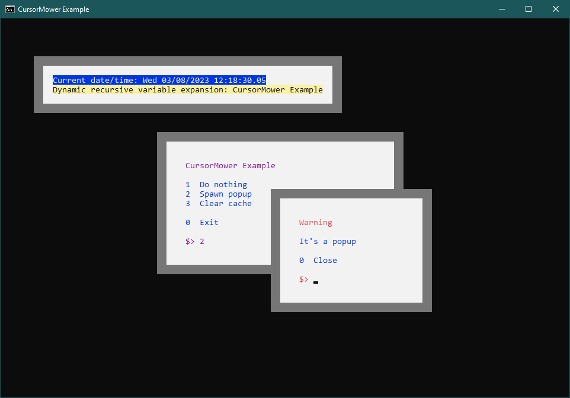
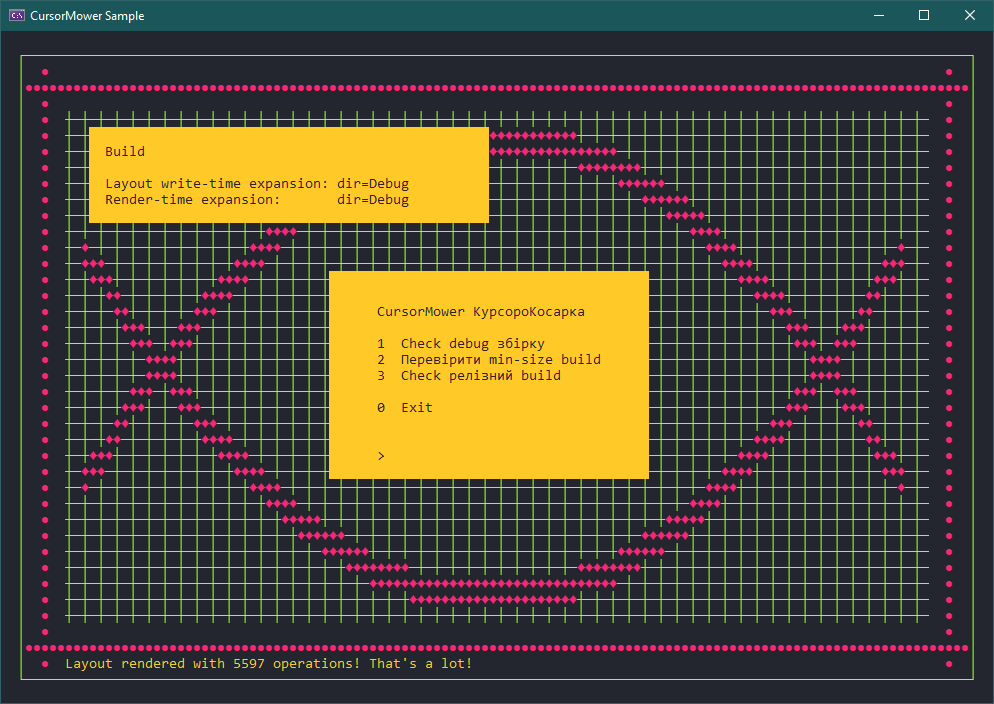

# CursorMower

A command line tool to help you build beautiful user interfaces for your Windows Batch files

## Dependencies

- UTF8-CPP\
    [Website](https://utfcpp.sourceforge.net)

## Layout File Syntax

*Detailed explanation with examples*

The tool uses special layout files of its own format to render the screen. Basically, the syntax can be explained as a simple option-parameters map

```ini
{option}
{option}={parameter}
{option}={parameter} {parameter}
```

> **Warning**
>
> Before you proceed
>
> - Zero-point of the coordinate system is `1;1` located in the top left corner of the console window and goes to the point `{width};{height}` in the bottom right corner
> - Most options have default actions assigned to them so most parameters are optional (exceptions below)

### Window Dimensions

To set window dimensions use `console_width` and `console_height` at the beginning of the file

```ini
console_width={columns}
console_height={lines}
```

> **Note**
>
> You can use these options only once per file

Example

```ini
console_width=120
console_height=40
```

> **Note**
>
> When a command line appears, its window dimensions are used by default so you can change only one if you need or don't apply any of them at all

### Inner Margin

You can set the inner window margin for your content not to touch the window border. The size of the window is increased automatically for the coordinates to stay unchanged. The default value is `0`

```ini
console_margin={lines}
```

> **Note**
>
> You can use this option only once per file

Example: point `1;1` with margin `1` becomes `3;2` automatically (1 line = 2 columns)

```ini
console_width=120
console_height=40
console_margin=1
```

### Cursor

The cursor option allows you to point out to a specific cell what you can use later to print some text or draw a rectangle. You can set it by specifying exact position

```ini
cursor1={x} {y}
cursor2={x} {y}
```

There're 2 cursors available to use

- `cursor1` is the main cursor. You can use it to print inline elements
- `cursor2` is the secondary required to draw rectangles

You can also move each cursor relatively

```ini
; Move cursor1
cursor1_up={lines}
cursor1_down={lines}
cursor1_left={columns}
cursor1_right={columns}

; Move cursor2
cursor2_up={lines}
cursor2_down={lines}
cursor2_left={columns}
cursor2_right={columns}
```

Or use much shorter aliases

```ini
; Move cursor1
up={lines}
down={lines}
left={columns}
right={columns}

; Move cursor2
up2={lines}
down2={lines}
left2={columns}
right2={columns}
```

Also, if you need to move a cursor by 1, you don't need to specify the value explicitly

```ini
; Move cursor1
up
down
left
right

; Move cursor2
up2
down2
left2
right2
```

Example

```ini
; These short commands
up=2
left

; Are equivalent to the following long ones
cursor1_up=2
cursor1_left=1
```

### Text

To print some text just use `text` and then literally anything as follows

```ini
cursor1={x} {y}
text={any text with spaces, Unicode characters, environment variables, etc.}
```

> **Note**
>
> Every `text` also invokes `down` command to print text line by line

Example

```ini
cursor1=5 2
text=Line 1
text=This line is below
down
text=A blank line was printed above
```

Output

```

     Line 1
     This line is below

     A blank line was printed above
```

You can also use variables and expand them during runtime to make your layout files dynamic

```batch
rem Expands in render-time
text=%userName%
text=%computerName%
text=%path%
```

However, dynamic variables like `%cd%`, `%date%`, `%time%`, `%random%` are not supported

### Colors

To make your text look prettier, you can use the `color` option with the same syntax as the default `color` command

```ini
color={0-f}{0-f}
```

Here's the default Command Prompt color reference

| Code | Color  | Code | Color        |
|:----:| ------ |:----:| ------------ |
|  0   | Black  |  8   | Gray         |
|  1   | Blue   |  9   | Light Blue   |
|  2   | Green  |  A   | Light Green  |
|  3   | Aqua   |  B   | Light Aqua   |
|  4   | Red    |  C   | Light Red    |
|  5   | Purple |  D   | Light Purple |
|  6   | Yellow |  E   | Light Yellow |
|  7   | White  |  F   | Bright White |

> **Note**
>
> If you the `color` option without parameters, the default color will be restored

The important difference from the builtin `color` command is that you change color attributes only for the text you print instead of the whole window

```ini
color=0b
text=Hello

color
text=is written with a different color
```

### Color Schemes

To extend coloring variety of Command Prompt you can remap any of 16 predefined colors with the following command. The general syntax is below

```ini
console_color={0-f}   {000000-ffffff}
console_color={color} {000000-ffffff}
```

The first parameter is a built-in color code and the second is the color you want to remap to. Here's an example to better understand it

```ini
; Remap black to red
console_color=0 ff0000

; Remap white to gray
console_color=f aaaaaa
```

And more advanced example (remap all the colors): set [Aurora](https://github.com/mbadolato/iTerm2-Color-Schemes#aurora) theme

```ini
console_color=0 23262e
console_color=1 0321d7
console_color=2 8fd46d
console_color=3 03d6b8
console_color=4 f0266f
console_color=5 ee5d43
console_color=6 ffe66d
console_color=7 ffca28
console_color=8 292e38
console_color=9 03d6b8
console_color=a 8fd46d
console_color=b 03d6b8
console_color=c f92672
console_color=d ee5d43
console_color=e ffe66d
console_color=f c74ded
```

Or the same example using color names instead

```ini
console_color=black         23262e
console_color=blue          0321d7
console_color=green         8fd46d
console_color=cyan          03d6b8
console_color=red           f0266f
console_color=purple        ee5d43
console_color=yellow        ffe66d
console_color=white         ffca28
console_color=bright-black  292e38
console_color=bright-blue   03d6b8
console_color=bright-green  8fd46d
console_color=bright-cyan   03d6b8
console_color=bright-red    f92672
console_color=bright-purple ee5d43
console_color=bright-yellow ffe66d
console_color=bright-white  c74ded
```

### Rectangle

This option allows you to draw rectangular boxes

```ini
cursor1=40 15
cursor2=80 27
color=70
clear
```

The option accepts the parameter `screen` to clear the whole screen much like the `cls` command does. Cursor options are omitted

```ini
; White theme
color=f0
clear=screen
```

### Caret

At the end of the file, you probably want to move the caret to a specific point to accept user input. You can use the `caret` option for this purpose

> **Note**
>
> You can use this option only once per file

Example

```
text=$> 
up
right=3
caret
```

Output

```
text=$> _
```

## Run

To process the layout file written just execute the following command

```batch
cursorMower "file"
```

Then you'll see the result (or some type of error)

### Error Levels

| Level | Explanation                                                                 |
|:-----:| --------------------------------------------------------------------------- |
|   0   | Everything is fine                                                          |
|   1   | Wrong number of command line arguments (or file specified)                  |
|   2   | Error reading the file (file not found or not accessible)                   |
|   3   | Illegal line syntax (check docs or use `/help`)                             |
|   4   | Out of screen buffer bounds (text or coords exceed window frame dimensions) |
|   5   | Help message is shown                                                       |

## Examples

You can write layout files by yourself but you can also generate them dynamically. You can also see how you can access your own variables and expand them during both write-time and render-time there. Use all the power of Batch available to you

There are 2 examples under the [demo](demo) directory available to test. Both expect the `cursorMower.exe` executable to be put in the same folder

```
Parent Dir
 ├─ cursorMower.exe
 ├─ example.cmd
 └─ sample.cmd
```

The `example.cmd` demonstrates some simple menu and a popup. Those are built dynamically and cached not to rewrite the same file over and over again



The `sample.cmd` is much more about building a little more complex layout mostly to test rendering performance and UTF8 support



That's all, have fun!
